# NextHire — Complete Class Diagram & Package Diagram

## 1. Complete Class Diagram

```mermaid
classDiagram

    %% ═══════════════════════════════════════
    %% CORE FRAMEWORK LAYER
    %% ═══════════════════════════════════════

    class Database {
        -PDO instance$
        -__construct()
        -__clone()
        +getInstance()$ PDO
    }

    class Router {
        -array routes$
        +dispatch(string page) void
        -resolveController(string page) array
    }

    class RBACMiddleware {
        +handle(string page) bool
        -checkPermission(string role, string page) bool
    }

    class StateMachine {
        -string currentState
        -array transitions
        +__construct(string initialState, array transitions)
        +getCurrentState() string
        +canTransitionTo(string toState) bool
        +getAllowedTransitions() array
        +transitionTo(string toState) string
    }

    class EventBus {
        -EventBus instance$
        -array~string,callable[]~ listeners
        -__construct()
        +getInstance()$ EventBus
        +subscribe(string event, callable listener) void
        +publish(string event, array payload) void
        +clearListeners(string event) void
    }

    class AuditLogger {
        -AuditLogger instance$
        -PDO db
        -__construct()
        +getInstance()$ AuditLogger
        +log(int actorId, string entityType, int entityId, string action, array before, array after) void
        +getRecent(int limit) array
    }

    class EmailService {
        -array config
        +sendInterviewInvite(array candidate, array panel) bool
        +sendOfferLetter(array candidate, array offer) bool
        +sendNotification(string to, string subject, string body) bool
    }

    %% ═══════════════════════════════════════
    %% ABSTRACT BASE CLASSES
    %% ═══════════════════════════════════════

    class BaseModel {
        <<abstract>>
        #PDO db
        #string table
        #string primaryKey
        +__construct()
        +findById(int id) array
        +findAll(string orderBy, string direction, int limit, int offset) array
        +create(array data) int
        +update(int id, array data) bool
        +delete(int id) bool
        +count(string where, array params) int
        +findWhere(string where, array params, string orderBy, string direction) array
        +findOneWhere(string where, array params) array
    }

    class BaseController {
        <<abstract>>
        #array currentUser
        +__construct()
        #requireAuth() void
        #requireRole(string|array roles) void
        #requirePermission(string permission) void
        #validateCsrf() bool
        #generateCsrf() string
        #csrfField() string
        #redirect(string url) void
        #jsonResponse(array data, int code) void
        #getPostData() array
        #getInput(string key, string default) string
        #getIntInput(string key, int default) int
        #setFlash(string type, string message) void
        #getFlash() array
        #render(string view, array data) void
        #renderLayout(string content, array data) void
        #isAjax() bool
    }

    %% ═══════════════════════════════════════
    %% MODEL LAYER (extends BaseModel)
    %% ═══════════════════════════════════════

    class UserModel {
        #string table = "users"
        +authenticate(string email, string password) array
        +findByEmail(string email) array
        +findByRole(string role) array
        +findById(int id) array
        +anonymize(int id) bool
    }

    class CandidateModel {
        #string table = "users"
        +findById(int id) array
        +findAll(string orderBy, string direction, int limit, int offset) array
        +getSkills(int candidateId) array
    }

    class JobRequisitionModel {
        #string table = "job_requisitions"
        +findWithCreator(int id) array
        +findByStatus(string status) array
        +findLive() array
        +getSkills(int jobId) array
        +addSkill(int jobId, string name, float weight, bool required) int
        +countByStatus() array
    }

    class ApplicationModel {
        #string table = "applications"
        +findByJob(int jobId) array
        +findByCandidate(int candidateId) array
        +findByStage(string stage) array
        +countByStage(int jobId) array
        +findDuplicates(string email, int jobId, int excludeId) array
        +getWithDetails(int id) array
        +getTopByMatchScore(int jobId, int limit) array
        +logStageChange(int appId, string from, string to, int actorId, string reason) void
        +getStageLog(int appId) array
    }

    class InterviewModel {
        #string table = "interview_panels"
        +findByApplication(int appId) array
        +findUpcoming(int userId, string role) array
        +getMembers(int panelId) array
        +addMember(int panelId, int userId, string role) void
    }

    class FeedbackModel {
        #string table = "feedback_submissions"
        +findByPanel(int panelId) array
        +getDimensions(int submissionId) array
        +addDimension(int submissionId, string dimension, float score, string notes) int
        +getPendingByInterviewer(int userId) array
        +getRedFlags(int submissionId) array
        +addRedFlag(int submissionId, string desc, string severity) int
    }

    class OfferModel {
        #string table = "offers"
        +findByApplication(int appId) array
        +getNegotiations(int offerId) array
        +addNegotiation(int offerId, int revision, float salary, string proposedBy, string notes) int
        +findExpired() array
        +getBackgroundCheck(int appId) array
        +getOnboardingChecklist(int appId) array
    }

    class AssessmentModel {
        #string table = "assessments"
        +findByJob(int jobId) array
    }

    class QuestionModel {
        #string table = "questions"
        +findByAssessment(int assessmentId) array
        +findByDifficulty(string difficulty, int assessmentId) array
        +findRandomByDifficulty(string difficulty, int limit, array excludeIds, int assessmentId) array
    }

    class NotificationModel {
        #string table = "notifications"
        +getUnread(int userId) array
        +markRead(int id) bool
        +createNotification(int userId, string type, string message, string entityType, int entityId) int
    }

    class AuditModel {
        #string table = "audit_log"
        +getRecent(int limit) array
        +findByEntity(string entityType, int entityId) array
        +delete(int id) bool
        +update(int id, array data) bool
    }

    %% ═══════════════════════════════════════
    %% CONTROLLER LAYER (extends BaseController)
    %% ═══════════════════════════════════════

    class AuthController {
        +index() void
        +login() void
        +register() void
        +logout() void
        +changePassword() void
    }

    class DashboardController {
        +index() void
        -hrDashboard() void
        -candidateDashboard() void
        -interviewerDashboard() void
        -deptManagerDashboard() void
    }

    class JobRequisitionController {
        +index() void
        +create() void
        +store() void
        +edit() void
        +view() void
    }

    class PipelineController {
        +index() void
        +transition() void
        +move() void
        +view() void
    }

    class InterviewController {
        +index() void
        +schedule() void
        +save() void
        +manage() void
        +reschedule() void
        +add_member() void
    }

    class LiveSessionController {
        +index() void
        +join() void
        +push() void
        +poll() void
        +feedback() void
        +updateTimer() void
        +endSession() void
    }

    class SchedulingController {
        +index() void
        +availability() void
    }

    class FeedbackController {
        +index() void
        +submit() void
        +view() void
    }

    class ApplicationController {
        +index() void
        +browse() void
        +apply() void
        +view() void
        +withdraw() void
    }

    class AssessmentController {
        +index() void
        +start() void
        +submit() void
        +result() void
    }

    class ProfileController {
        +index() void
    }

    class OfferController {
        +index() void
        +create() void
        +send() void
        +accept() void
        +decline() void
        +negotiate() void
    }

    class AdminController {
        +index() void
        +create() void
        +edit() void
        +deactivate() void
        +search() void
    }

    class AnalyticsController {
        +index() void
    }

    class ComplianceController {
        +index() void
        +retention() void
    }

    class DeptManagerController {
        +index() void
        +approve() void
        +reject() void
    }

    class ShortlistingController {
        +index() void
    }

    class ReferralController {
        +index() void
        +create() void
    }

    class OnboardingController {
        +index() void
    }

    class PanelController {
        +index() void
    }

    class QuestionBankController {
        +index() void
        +create() void
        +edit() void
        +delete() void
    }

    %% ═══════════════════════════════════════
    %% SERVICE LAYER
    %% ═══════════════════════════════════════

    class ScoringStrategyInterface {
        <<interface>>
        +calculate(array jobSkills, array candidateSkills) float
    }

    class WeightedAverageStrategy {
        +calculate(array jobSkills, array candidateSkills) float
    }

    class NormalizedScoringStrategy {
        +calculate(array jobSkills, array candidateSkills) float
    }

    class SkillWeightingService {
        -ScoringStrategyInterface strategy
        -JobRequisitionModel jobModel
        -CandidateModel candidateModel
        +__construct(ScoringStrategyInterface strategy)
        +calculateMatchScore(int jobId, int candidateId) float
    }

    class ScreeningTriageService {
        -ApplicationModel appModel
        -EventBus eventBus
        -AuditLogger audit
        +transition(int applicationId, string toStage, int actorId, string reason) bool
        +getAllowedTransitions(int applicationId) array
        -createInterviewPanel(int applicationId, int actorId) void
    }

    class DeduplicationService {
        +findDuplicates(int applicationId) array
        +markDuplicate(int applicationId, int duplicateOfId) void
    }

    class ShortlistingService {
        +getShortlist(int jobId, int limit) array
        +autoShortlist(int jobId, float threshold) array
    }

    class PanelBuilderService {
        +buildPanel(int jobId, int applicationId) array
        +suggestInterviewers(int jobId) array
    }

    class AvailabilityResolverService {
        +getAvailableSlots(int userId, string date) array
        +checkConflicts(int userId, string datetime, int duration) bool
    }

    class LoadBalancerService {
        +getLeastLoadedInterviewer(array interviewerIds) int
    }

    class LiveCodingSyncService {
        +pushCode(int sessionId, string code) void
        +pullCode(int sessionId) string
    }

    class SessionExtensionService {
        +extend(int panelId, int minutes, int actorId) bool
    }

    class BriefingGeneratorService {
        +generate(int panelId) array
    }

    class ShadowingService {
        +assignShadow(int panelId, int shadowId) void
    }

    class FeedbackAggregatorService {
        +aggregate(int panelId) array
    }

    class ScoreNormalizationService {
        +normalize(array scores) float
    }

    class HiringRecommendationService {
        +decide(int applicationId) string
    }

    class RedFlagService {
        +flag(int submissionId, string description, string severity) void
        +checkAutoFreeze(int applicationId) bool
    }

    class ConsensusService {
        +checkConsensus(int panelId) array
    }

    class CompetencyGapService {
        +analyze(int applicationId) array
    }

    class SentimentLoggerService {
        +log(int candidateId, int panelId, int score, string comment) void
    }

    class OfferCalculatorService {
        +calculate(string level, string tier, string roleType) array
    }

    class OfferLetterService {
        +generate(int offerId) string
    }

    class OfferValidityService {
        +checkExpiry(int offerId) bool
        +expireAll() int
    }

    class NegotiationTrackerService {
        +addRound(int offerId, float salary, string proposedBy) void
    }

    class PdfGeneratorService {
        +generateOfferPdf(array offer, array candidate, array job) string
    }

    class BackgroundCheckService {
        +initiate(int applicationId) void
        +updateStatus(int checkId, string status) void
    }

    class OnboardingPortalService {
        +createChecklist(int applicationId) void
        +updateItem(int checklistId, string status) void
    }

    class ReferralService {
        +create(int referrerId, string candidateEmail, int jobId) int
        +track(int referralId) array
    }

    class QuestionBankService {
        +generateSet(int assessmentId) array
        +getByTags(array tags) array
    }

    class CodeValidatorService {
        +validate(string code, string language, string expectedOutput) array
    }

    class ProctoringService {
        +recordEvent(int sessionId, string eventType) void
        +getStrikes(int sessionId) int
    }

    class CooldownService {
        +isOnCooldown(int candidateId, int assessmentId) bool
        +getCooldownEnd(int candidateId, int assessmentId) string
    }

    class PlagiarismService {
        +check(string code, int assessmentId) float
    }

    class DifficultyAdjustmentService {
        +adjust(int assessmentId, array results) void
    }

    class SessionHeartbeatService {
        +beat(int sessionId) void
        +isAlive(int sessionId) bool
    }

    class AuditTrailService {
        +getRecent(int limit) array
    }

    class DataRetentionService {
        +runRetentionPass() array
    }

    class DatabaseIntegrityService {
        +runIntegrityPass() array
    }

    class DiversityReportService {
        +generateReport(int jobId) array
    }

    class NotificationEscalatorService {
        +escalate(int notificationId) void
        +checkPending() array
    }

    class RBACService {
        +hasPermission(string role, string permission) bool
    }

    class TemplateVersioningService {
        +getActive(string type) array
        +createVersion(string type, string content) int
    }

    class ApprovalWorkflowService {
        +submit(int jobId) void
        +approve(int jobId, int managerId) void
        +reject(int jobId, int managerId, string reason) void
    }

    class JobBoardSyncService {
        +sync(int jobId) bool
        +unsync(int jobId) bool
    }

    class ThroughputAnalyticsService {
        +calculateMetrics(int jobId) array
    }

    %% ═══════════════════════════════════════
    %% INHERITANCE RELATIONSHIPS
    %% ═══════════════════════════════════════

    BaseModel <|-- UserModel
    BaseModel <|-- CandidateModel
    BaseModel <|-- JobRequisitionModel
    BaseModel <|-- ApplicationModel
    BaseModel <|-- InterviewModel
    BaseModel <|-- FeedbackModel
    BaseModel <|-- OfferModel
    BaseModel <|-- AssessmentModel
    BaseModel <|-- QuestionModel
    BaseModel <|-- NotificationModel
    BaseModel <|-- AuditModel

    BaseController <|-- AuthController
    BaseController <|-- DashboardController
    BaseController <|-- JobRequisitionController
    BaseController <|-- PipelineController
    BaseController <|-- InterviewController
    BaseController <|-- LiveSessionController
    BaseController <|-- SchedulingController
    BaseController <|-- FeedbackController
    BaseController <|-- ApplicationController
    BaseController <|-- AssessmentController
    BaseController <|-- ProfileController
    BaseController <|-- OfferController
    BaseController <|-- AdminController
    BaseController <|-- AnalyticsController
    BaseController <|-- ComplianceController
    BaseController <|-- DeptManagerController
    BaseController <|-- ShortlistingController
    BaseController <|-- ReferralController
    BaseController <|-- OnboardingController
    BaseController <|-- PanelController
    BaseController <|-- QuestionBankController

    ScoringStrategyInterface <|.. WeightedAverageStrategy : implements
    ScoringStrategyInterface <|.. NormalizedScoringStrategy : implements

    %% ═══════════════════════════════════════
    %% COMPOSITION & AGGREGATION
    %% ═══════════════════════════════════════

    SkillWeightingService *-- ScoringStrategyInterface : strategy 1
    SkillWeightingService *-- JobRequisitionModel : jobModel 1
    SkillWeightingService *-- CandidateModel : candidateModel 1

    ScreeningTriageService *-- ApplicationModel : appModel 1
    ScreeningTriageService *-- EventBus : eventBus 1
    ScreeningTriageService *-- AuditLogger : audit 1

    AuditLogger o-- Database : db 1
    BaseModel o-- Database : db 1
    BaseController o-- UserModel : loads currentUser

    %% ═══════════════════════════════════════
    %% ASSOCIATIONS (dependency / usage)
    %% ═══════════════════════════════════════

    Router --> BaseController : dispatches
    Router --> RBACMiddleware : uses
    RBACMiddleware --> BaseController : guards

    DashboardController --> ApplicationModel : queries
    DashboardController --> InterviewModel : queries
    DashboardController --> NotificationModel : queries
    DashboardController --> JobRequisitionModel : queries

    PipelineController --> ScreeningTriageService : uses
    PipelineController --> ApplicationModel : queries

    InterviewController --> InterviewModel : manages
    InterviewController --> ApplicationModel : queries
    InterviewController --> UserModel : queries

    LiveSessionController --> InterviewModel : queries
    LiveSessionController --> FeedbackModel : submits
    LiveSessionController --> AuditLogger : logs
    LiveSessionController --> EventBus : publishes

    FeedbackController --> FeedbackModel : manages
    FeedbackController --> HiringRecommendationService : triggers

    ApplicationController --> ApplicationModel : manages
    ApplicationController --> SkillWeightingService : scores
    ApplicationController --> DeduplicationService : checks

    AssessmentController --> AssessmentModel : queries
    AssessmentController --> QuestionModel : loads
    AssessmentController --> ProctoringService : monitors
    AssessmentController --> CooldownService : checks

    OfferController --> OfferModel : manages
    OfferController --> OfferCalculatorService : calculates
    OfferController --> PdfGeneratorService : generates

    AdminController --> UserModel : manages
    ComplianceController --> AuditTrailService : queries
    ComplianceController --> DataRetentionService : executes
    ComplianceController --> DatabaseIntegrityService : checks

    AnalyticsController --> ThroughputAnalyticsService : queries
    AnalyticsController --> DiversityReportService : queries

    JobRequisitionController --> JobRequisitionModel : manages
    JobRequisitionController --> ApprovalWorkflowService : submits

    DeptManagerController --> JobRequisitionModel : approves
    DeptManagerController --> ApprovalWorkflowService : uses

    ShortlistingController --> ShortlistingService : uses
    ReferralController --> ReferralService : uses
    OnboardingController --> OnboardingPortalService : uses
    QuestionBankController --> QuestionModel : manages
    QuestionBankController --> QuestionBankService : uses

    HiringRecommendationService --> FeedbackAggregatorService : aggregates
    HiringRecommendationService --> AuditLogger : logs
    ScreeningTriageService --> UserModel : queries
    ScreeningTriageService --> StateMachine : validates

    DataRetentionService --> UserModel : anonymizes
    AuditLogger --> EventBus : publishes

    SchedulingController --> InterviewModel : queries
    SchedulingController --> AvailabilityResolverService : checks
    PanelController --> InterviewModel : queries
```

---

## 2. Package Diagram

```mermaid
graph TB
    subgraph "<<Package>> Core Framework"
        Database
        Router
        RBACMiddleware
        StateMachine
        EventBus
        AuditLogger
        EmailService
        BaseModel
        BaseController
    end

    subgraph "<<Package>> Models"
        UserModel
        CandidateModel
        JobRequisitionModel
        ApplicationModel
        InterviewModel
        FeedbackModel
        OfferModel
        AssessmentModel
        QuestionModel
        NotificationModel
        AuditModel
    end

    subgraph "<<Package>> Controllers::Auth"
        AuthController
    end

    subgraph "<<Package>> Controllers::Dashboard"
        DashboardController
    end

    subgraph "<<Package>> Controllers::HR"
        JobRequisitionController
        PipelineController
        InterviewController_HR["InterviewController"]
        OfferController
        AdminController
        AnalyticsController
        ComplianceController
        ShortlistingController
        ReferralController
        OnboardingController
    end

    subgraph "<<Package>> Controllers::Interviewer"
        LiveSessionController
        SchedulingController
        FeedbackController
        PanelController
        QuestionBankController
    end

    subgraph "<<Package>> Controllers::Candidate"
        ApplicationController
        AssessmentController_C["AssessmentController"]
        ProfileController
    end

    subgraph "<<Package>> Controllers::DeptManager"
        DeptManagerController
    end

    subgraph "<<Package>> Services::Pipeline"
        ScreeningTriageService
        SkillWeightingService
        DeduplicationService
        ShortlistingService
        ApprovalWorkflowService
        JobBoardSyncService
        ThroughputAnalyticsService
    end

    subgraph "<<Package>> Services::Interview"
        PanelBuilderService
        AvailabilityResolverService
        LoadBalancerService
        LiveCodingSyncService
        SessionExtensionService
        BriefingGeneratorService
        ShadowingService
    end

    subgraph "<<Package>> Services::Feedback"
        FeedbackAggregatorService
        ScoreNormalizationService
        HiringRecommendationService
        RedFlagService
        ConsensusService
        CompetencyGapService
        SentimentLoggerService
    end

    subgraph "<<Package>> Services::Assessment"
        QuestionBankService
        CodeValidatorService
        ProctoringService
        CooldownService
        PlagiarismService
        DifficultyAdjustmentService
        SessionHeartbeatService
    end

    subgraph "<<Package>> Services::Offer"
        OfferCalculatorService
        OfferLetterService
        OfferValidityService
        NegotiationTrackerService
        PdfGeneratorService
        BackgroundCheckService
        OnboardingPortalService
        ReferralService
    end

    subgraph "<<Package>> Services::Admin"
        AuditTrailService
        DataRetentionService
        DatabaseIntegrityService
        DiversityReportService
        NotificationEscalatorService
        RBACService
        TemplateVersioningService
    end

    subgraph "<<Package>> Strategy"
        ScoringStrategyInterface
        WeightedAverageStrategy
        NormalizedScoringStrategy
    end

    %% ═══ Package Dependencies ═══

    Models -->|extends| Core_Framework
    Controllers_HR -->|uses| Models
    Controllers_HR -->|uses| Services_Pipeline
    Controllers_HR -->|uses| Services_Offer
    Controllers_HR -->|uses| Services_Admin
    Controllers_Interviewer -->|uses| Models
    Controllers_Interviewer -->|uses| Services_Interview
    Controllers_Interviewer -->|uses| Services_Feedback
    Controllers_Candidate -->|uses| Models
    Controllers_Candidate -->|uses| Services_Assessment
    Controllers_Candidate -->|uses| Services_Pipeline
    Controllers_Dashboard -->|uses| Models
    Controllers_Auth -->|uses| Models
    Controllers_DeptManager -->|uses| Services_Pipeline
    Services_Pipeline -->|uses| Models
    Services_Pipeline -->|uses| Core_Framework
    Services_Pipeline -->|uses| Strategy
    Services_Interview -->|uses| Models
    Services_Feedback -->|uses| Models
    Services_Feedback -->|uses| Core_Framework
    Services_Assessment -->|uses| Models
    Services_Offer -->|uses| Models
    Services_Admin -->|uses| Models
    Services_Admin -->|uses| Core_Framework
    Core_Framework -->|contains| Database
```



---

## 3. Relationship Summary Table

| Relationship Type | From | To | Multiplicity | Description |
|---|---|---|---|---|
| **Inheritance** | UserModel | BaseModel | — | All models extend BaseModel |
| **Inheritance** | All Controllers | BaseController | — | All controllers extend BaseController |
| **Interface Impl** | WeightedAverageStrategy | ScoringStrategyInterface | — | Strategy Pattern |
| **Interface Impl** | NormalizedScoringStrategy | ScoringStrategyInterface | — | Strategy Pattern |
| **Composition** | SkillWeightingService | ScoringStrategyInterface | 1..1 | Owns strategy instance |
| **Composition** | ScreeningTriageService | ApplicationModel | 1..1 | Owns model instance |
| **Aggregation** | BaseModel | Database | *..1 | Shared singleton DB connection |
| **Aggregation** | AuditLogger | Database | 1..1 | Shared singleton DB connection |
| **Dependency** | PipelineController | ScreeningTriageService | — | Uses for stage transitions |
| **Dependency** | ApplicationController | SkillWeightingService | — | Uses for match scoring |
| **Dependency** | HiringRecommendationService | FeedbackAggregatorService | — | Delegates score aggregation |
| **Dependency** | ScreeningTriageService | StateMachine | — | Creates per-transition |
| **Dependency** | Router | RBACMiddleware | — | Guards before dispatch |
| **Self-Association** | ApplicationModel | ApplicationModel | — | findDuplicates references same table |
| **Association Class** | InterviewModel manages panel_members | UserModel ↔ InterviewModel | *..* | panel_members is association class |
| **Qualified** | FeedbackModel | FeedbackModel | — | getDimensions qualified by submission_id |
