# PART 2: System Design & Models

---

## 8) Functional Diagrams

### a) Use-Case Diagram (Mermaid Notation)

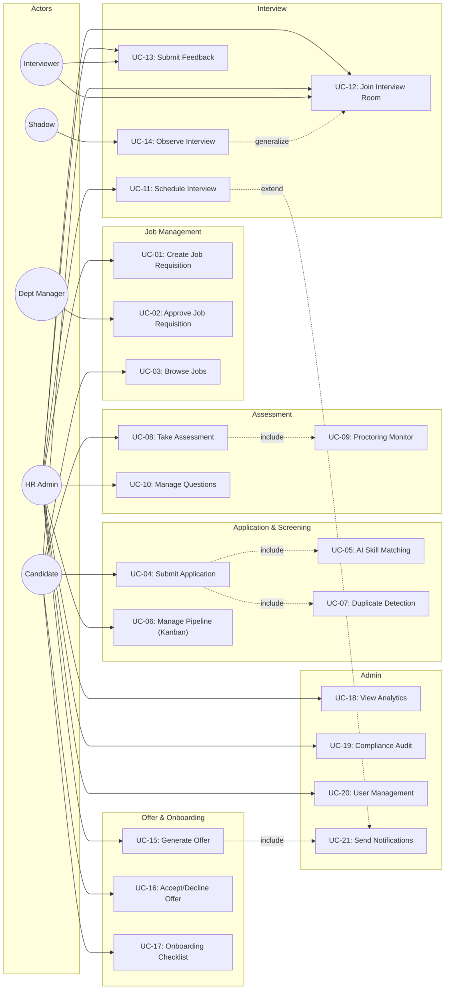

### b) Detailed Use-Case Descriptions

#### UC-01: Create Job Requisition

| Field | Description |
|-------|------------|
| **ID** | UC-01 |
| **Name** | Create Job Requisition |
| **Goal** | HR Admin creates a new job opening with all required details |
| **Initiator** | HR Admin |
| **Pre-conditions** | User is authenticated with role `hr_admin` |
| **Post-conditions** | New job_requisitions record created with status `draft` |
| **Main Success Scenario** | 1. HR navigates to Jobs → Create New 2. Fills title, department, description, requirements, level, location tier 3. Submits form 4. System validates, inserts record, logs audit entry 5. Redirects to job list with success message |
| **Alternative Scenarios** | A1: Validation fails → Show error, retain form data A2: Duplicate title in same dept → Warn but allow |

#### UC-04: Submit Application

| Field | Description |
|-------|------------|
| **ID** | UC-04 |
| **Name** | Submit Application |
| **Goal** | Candidate applies to a live job with resume |
| **Initiator** | Candidate |
| **Pre-conditions** | Job status = 'live', candidate authenticated, no existing application for same job |
| **Post-conditions** | Application record with stage='applied', match_score computed |
| **Main Success Scenario** | 1. Candidate browses jobs 2. Clicks Apply on a job 3. Uploads resume/CV 4. System parses resume, computes match_score via SkillWeightingService 5. Checks for duplicates via DeduplicationService 6. Creates application record 7. Redirects to My Applications |
| **Alternative Scenarios** | A1: Already applied → Show error "You have already applied" A2: Match score < 80% → Application still created but flagged |

#### UC-08: Take Assessment

| Field | Description |
|-------|------------|
| **ID** | UC-08 |
| **Name** | Take Assessment |
| **Goal** | Candidate completes a timed technical assessment |
| **Initiator** | Candidate |
| **Pre-conditions** | Application at stage='technical_test', assessment exists for job, cooldown period elapsed |
| **Post-conditions** | candidate_sessions record with status='submitted', answers scored |
| **Main Success Scenario** | 1. Candidate navigates to Assessments 2. Starts assessment → timer begins 3. Answers MCQ/coding/text questions 4. Proctoring monitors tab switches (max 3 strikes) 5. Submits before timer expires 6. System scores answers, computes integrity_score |
| **Unsuccessful Scenarios** | U1: 3 tab switches → Session auto-flagged, terminated U2: Timer expires → Auto-submit with current answers |

#### UC-11: Schedule Interview

| Field | Description |
|-------|------------|
| **ID** | UC-11 |
| **Name** | Schedule Interview |
| **Goal** | HR Admin schedules an interview panel for a candidate |
| **Initiator** | HR Admin (or auto-triggered by pipeline transition) |
| **Pre-conditions** | Application at stage='interview' |
| **Post-conditions** | interview_panels record created, panel_members assigned, candidate notified |
| **Main Success Scenario** | 1. HR navigates to Interview Management 2. Selects application (or system auto-creates on stage transition) 3. Sets date/time, duration, coding language 4. Assigns interviewers from available list 5. System creates panel, generates candidate_token 6. Notification sent to candidate |
| **Alternative Scenarios** | A1: Panel already exists → Show existing panel for management |

#### UC-12: Join Interview Room

| Field | Description |
|-------|------------|
| **ID** | UC-12 |
| **Name** | Join Interview Room |
| **Goal** | Participant enters the live coding interview environment |
| **Initiator** | Candidate, Interviewer, HR Admin, or Shadow |
| **Pre-conditions** | Panel exists with status 'scheduled' or 'active', user is authorized |
| **Post-conditions** | Panel status = 'active', live_session row exists, user in interview room |
| **Main Success Scenario** | 1. User clicks "Join" from dashboard/schedule 2. System verifies role and panel membership 3. Activates panel if scheduled 4. Creates live_session if not exists 5. Renders full-screen interview room with code editor, timer, feedback panel |
| **Alternative Scenarios** | A1: Candidate not owner → Redirect with error A2: Interviewer not panel member → Redirect with error |

#### UC-13: Submit Feedback

| Field | Description |
|-------|------------|
| **ID** | UC-13 |
| **Name** | Submit Interview Feedback |
| **Goal** | Evaluator submits structured feedback for a candidate |
| **Initiator** | Interviewer, HR Admin, Shadow |
| **Pre-conditions** | Panel status = 'active' or 'completed', user hasn't already submitted |
| **Post-conditions** | feedback_submissions + feedback_dimensions records created, hiring_recommendations upserted |
| **Main Success Scenario** | 1. Evaluator scores overall (0–10) and 4 dimensions 2. Interviewer selects hiring recommendation 3. Adds comments 4. Submits → System computes normalized score, updates recommendation 5. Redirect to dashboard |
| **Alternative Scenarios** | A1: Shadow submits → include_in_score=0, score not counted A2: Already submitted → Show "already submitted" message |

### c) Package Diagram

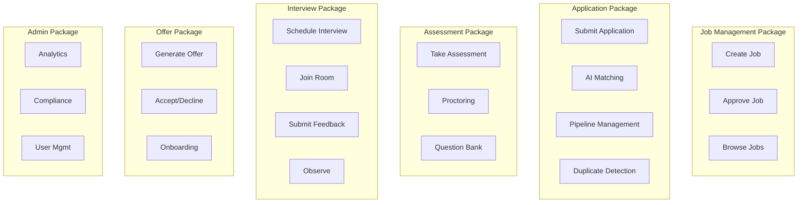

---

## 9) Structural & Behavioural Diagrams

### a) System Architecture

**Pattern: Model-View-Controller (MVC) with Service Layer**

```
┌─────────────────────────────────────────────┐
│                  Browser                     │
├─────────────────────────────────────────────┤
│              index.php (Front Controller)    │
├─────────────────────────────────────────────┤
│   Router.php → dispatches to Controllers     │
├──────────┬──────────┬───────────────────────┤
│Controllers│  Views   │   RBACMiddleware       │
│(Business  │(PHP/HTML │   (Security Layer)     │
│ Logic)    │Templates)│                        │
├──────────┴──────────┴───────────────────────┤
│              Service Layer                   │
│  ScreeningTriageService, SkillWeightingService│
│  PanelBuilderService, EmailService, etc.     │
├─────────────────────────────────────────────┤
│              Model Layer                     │
│  BaseModel → UserModel, ApplicationModel,    │
│  InterviewModel, FeedbackModel, etc.         │
├─────────────────────────────────────────────┤
│        Database.php (PDO Singleton)          │
├─────────────────────────────────────────────┤
│              MySQL (InnoDB)                  │
└─────────────────────────────────────────────┘
```

**Patterns Used:**
1. **Front Controller** (index.php) — Single entry point for all requests. *Why:* Centralizes error handling, session management, CSRF protection.
2. **MVC** — Controllers handle logic, Views render HTML, Models manage data. *Why:* Separation of concerns.
3. **State Machine** (StateMachine.php) — Enforces valid pipeline transitions. *Why:* Prevents invalid stage changes.
4. **Observer** (EventBus.php) — Publish/subscribe for side-effects. *Why:* Decouples core logic from notifications/sync.
5. **Singleton** (Database.php) — One DB connection per request. *Why:* Resource efficiency.
6. **Strategy** (SkillWeightingService) — Pluggable matching algorithms. *Why:* Easy to swap scoring logic.

### b) Activity Diagrams

#### AD-1: Job Requisition Creation & Approval

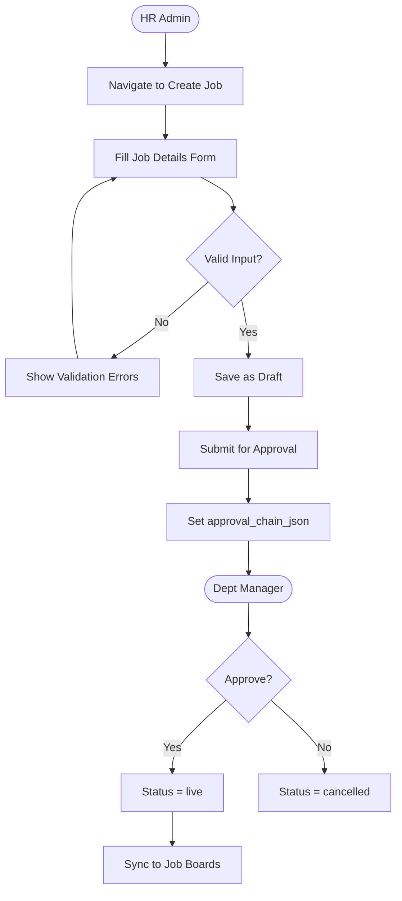

#### AD-2: Candidate Application Submission

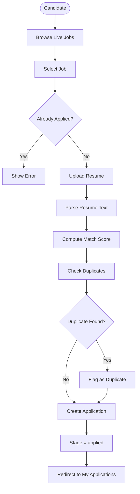

#### AD-3: Pipeline Stage Transition

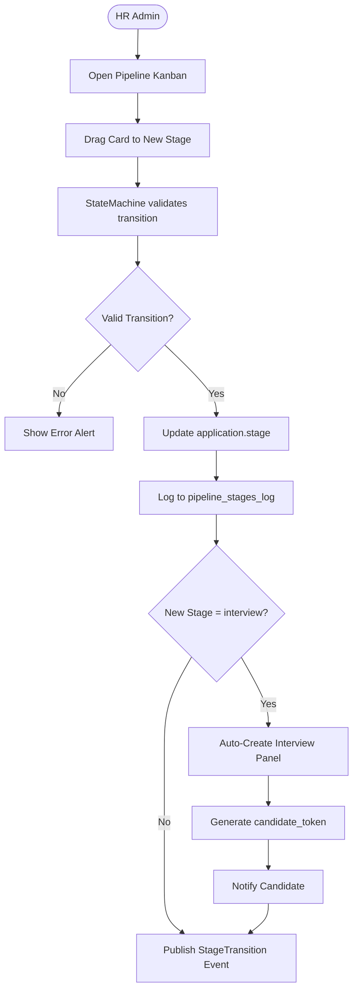

#### AD-4: Assessment Taking with Proctoring

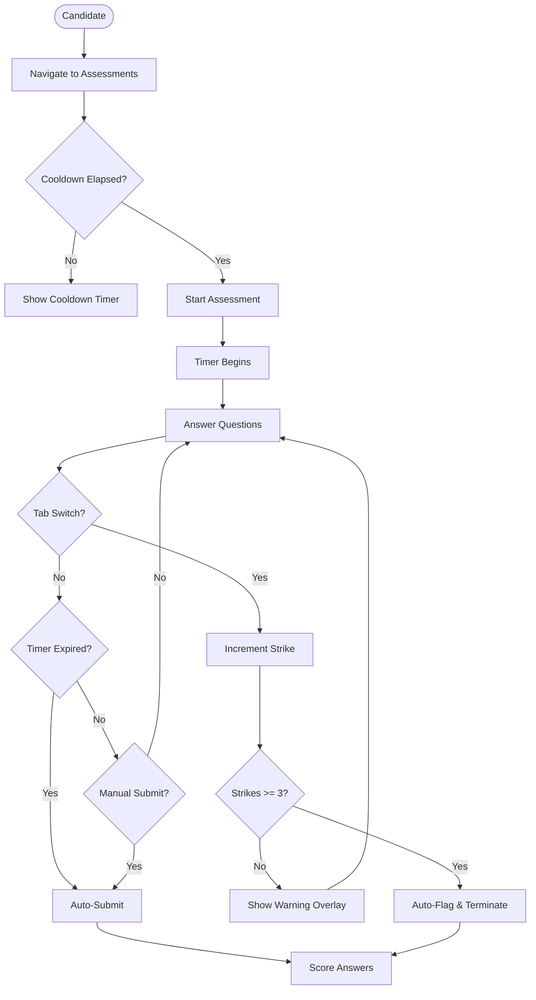

#### AD-5: Interview Room Session

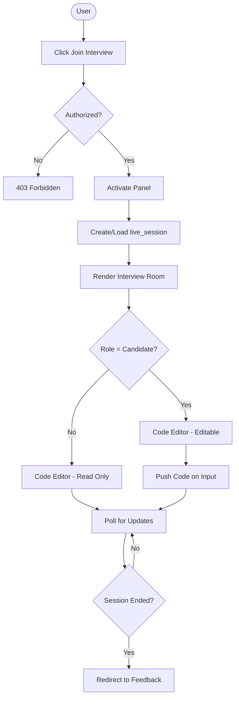

#### AD-6: Feedback Submission

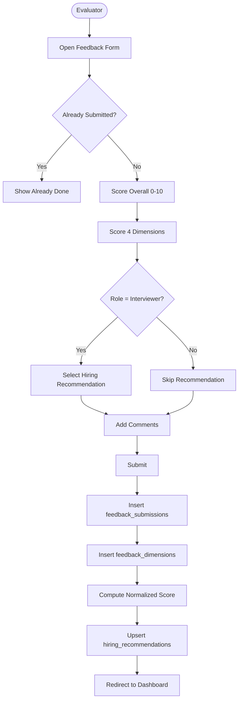

#### AD-7: Offer Generation & Acceptance

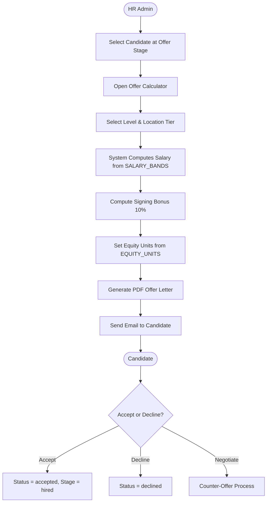

### c) User Interfaces Required

| Interface | Users | Derived From |
|-----------|-------|-------------|
| Login/Register Page | All | AD-1 to AD-7 |
| HR Dashboard | HR Admin | AD-1, AD-3 |
| Candidate Dashboard | Candidate | AD-2, AD-4, AD-5 |
| Interviewer Dashboard | Interviewer, Shadow | AD-5, AD-6 |
| Job Requisition Form | HR Admin | AD-1 |
| Job Browse/Search | Candidate | AD-2 |
| Pipeline Kanban Board | HR Admin | AD-3 |
| Assessment Test Page | Candidate | AD-4 |
| Interview Room (Full-screen) | All (except Dept Manager) | AD-5 |
| Feedback Form | Interviewer, HR, Shadow | AD-6 |
| Offer Management Page | HR Admin | AD-7 |
| Interview Management Page | HR Admin | AD-5 |
| Interview Schedule Page | Interviewer, HR | AD-5 |
| My Interviews Page | Candidate | AD-5 |
| Profile Page | Candidate | — |
| Admin/User Management | HR Admin | — |
| Compliance Dashboard | HR Admin | — |
| Analytics Dashboard | HR Admin | — |

### d) Class Diagram 1 (Initial)

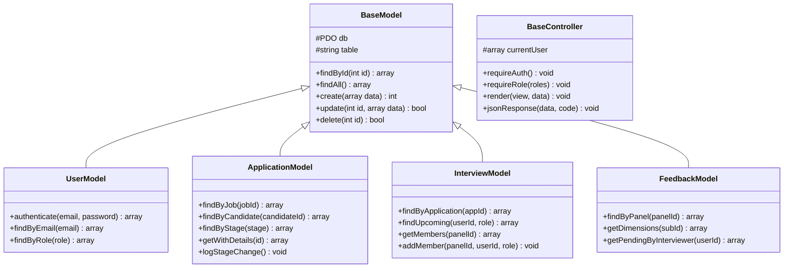

### h) Use-Case Implementation Strategy

**Strategy: Use-Case Class**

Each major use case maps to a dedicated Controller class:
- `JobRequisitionController` → UC-01, UC-02, UC-03
- `ApplicationController` → UC-04
- `PipelineController` → UC-06
- `AssessmentController` → UC-08
- `InterviewController` → UC-11
- `LiveSessionController` → UC-12
- `FeedbackController` → UC-13
- `OfferController` → UC-15, UC-16

**Advantages:** High cohesion — each controller handles one workflow. Easy to locate code for a specific feature. Follows Single Responsibility Principle.

**Disadvantages:** May lead to many small controllers. Cross-cutting concerns (auth, CSRF) handled by inheritance from BaseController.

### j) Three Design Patterns Applied

#### 1. State Machine Pattern
- **Problem:** Pipeline stages must follow strict transition rules (e.g., `applied` → `screening` is valid, but `applied` → `offer` is not).
- **Solution:** `StateMachine` class initialized with current state and `STAGE_TRANSITIONS` config. `transitionTo()` validates against allowed transitions.
- **Effect:** New stages added by editing config array — zero code changes in business logic.

#### 2. Observer Pattern (EventBus)
- **Problem:** Stage transitions need to trigger notifications, job board sync, red flag handling — but core logic shouldn't know about these.
- **Solution:** `EventBus::publish()` fires events; subscribers registered in `index.php` handle side-effects.
- **Effect:** Adding new subscribers (e.g., Slack notification) requires zero changes to existing code.

#### 3. Singleton Pattern (Database)
- **Problem:** Creating multiple database connections per request wastes resources and complicates transaction management.
- **Solution:** `Database::getInstance()` returns a single PDO instance, lazily initialized.
- **Effect:** All models share one connection; consistent transaction boundaries.

### n) Forks vs Cascades

**Choice: Cascades** — Used in interaction diagrams where Controller → Service → Model chains occur sequentially.

**Example:** `PipelineController::transition()` → `ScreeningTriageService::transition()` → `ApplicationModel::update()` → `ApplicationModel::logStageChange()` → `AuditLogger::log()` → `EventBus::publish()`

**Advantage:** Clear linear flow, easy to trace and debug. Each object completes its work before passing control.

**Disadvantage:** Deep call chains increase coupling; a failure in any step may require complex rollback logic.

### o) Package Diagram (Classes)

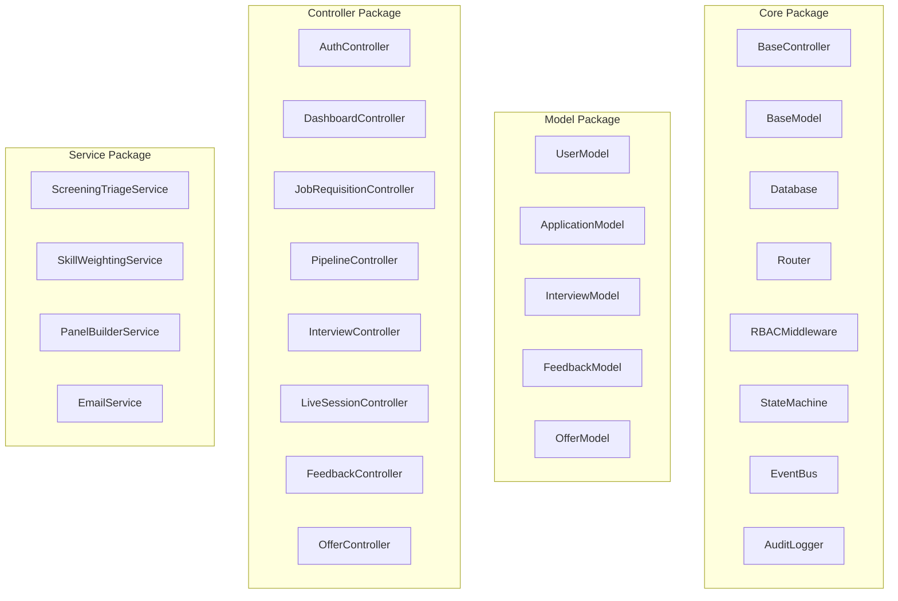

### q) Database Specification (ERD Summary)

**Core Tables and Relationships:**

| Table | PK | Key Foreign Keys |
|-------|-----|-----------------|
| users | id | — |
| job_requisitions | id | created_by → users |
| job_skills | id | job_id → job_requisitions |
| applications | id | job_id → job_requisitions, candidate_id → users |
| pipeline_stages_log | id | application_id → applications, actor_id → users |
| assessments | id | job_id → job_requisitions |
| questions | id | assessment_id → assessments |
| candidate_sessions | id | candidate_id → users, assessment_id → assessments |
| interview_panels | id | job_id → job_requisitions, application_id → applications |
| panel_members | id | panel_id → interview_panels, user_id → users |
| live_sessions | id | panel_id → interview_panels |
| feedback_submissions | id | panel_id → interview_panels, interviewer_id → users, candidate_id → users |
| feedback_dimensions | id | submission_id → feedback_submissions |
| offers | id | application_id → applications, created_by → users |
| notifications | id | user_id → users |
| audit_log | id | actor_id → users |

**Total: 25 tables with full referential integrity (InnoDB with FOREIGN KEY constraints)**
